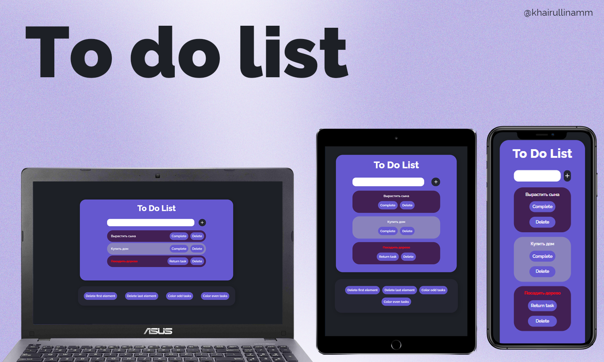

# toDoList

## Description
The "To do list" project is a web application with the ability to add tasks, marking their completion, deleting them and storing them in local storage.

You can try it here: https://khairullinamm.github.io/toDoList/

## Technology stack
1. FlexBox 
2. Adaptive layout
3. HTML code checked by the W3C
4. LocalStorage

## Features

You can:
1. Add a new task
2. Mark the task as completed (it will go down the list)
3. Delete a specific task
4. Delete the first task
5. Delete the last task
6. Color-mark all even-numbered tasks
7. Color-mark all odd tasks

**Additional functions**
1. You cannot enter more than 25 characters
2. You cannot enter the same tasks
3. You cannot use the buttons in the navigation bar if there are no tasks
4. "Even" tasks cannot be marked with color if there is only 1 task
   
## Project status
_Project is: complete._

## Contacts 
[@milanahmm](https://t.me/milanahmm) - contact me!
